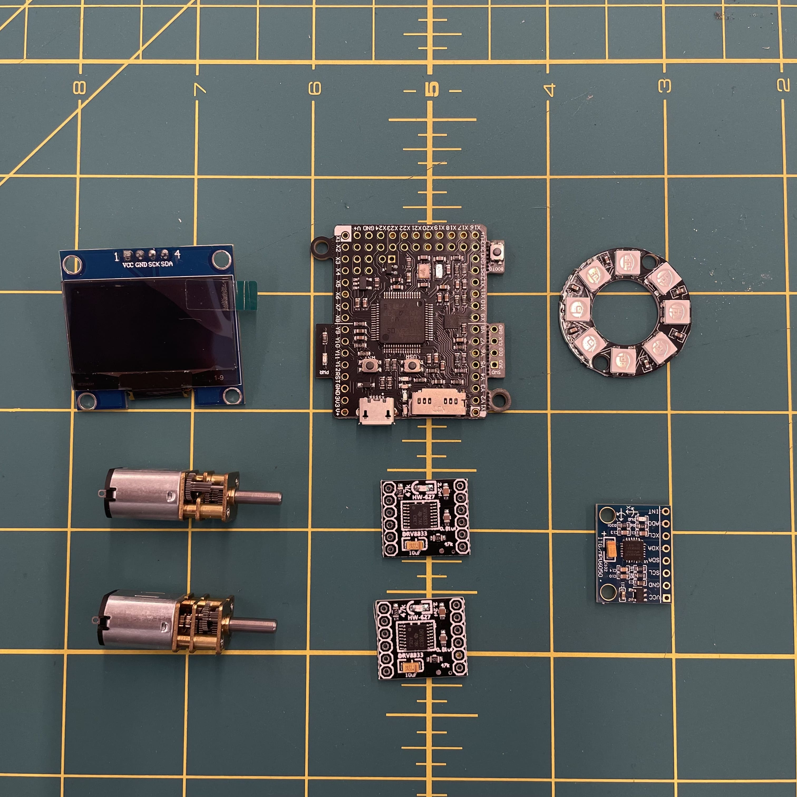

| # Prototipo | Fecha |Propósito/Objetivo | Prototipo Evidencia|
| :---: | :---: |:--- | :--- |
| 1 | 1-1-2024 | Componentes a utilizar en el prototipo|   |
| 2 | 1-1-2024 | Layout de distribucion de componentes|  |
| 3 | 1-1-2024 | Scketch de distribucion de componentes| |
| 4 | 1-1-2024 | **PROTOTIPO v1** - Uso de carton para el prototipo, revisar tamaños y distribucion de componentes|      |
| 5 | 1-1-2024 | Scketch de distribucion de componentes| |
