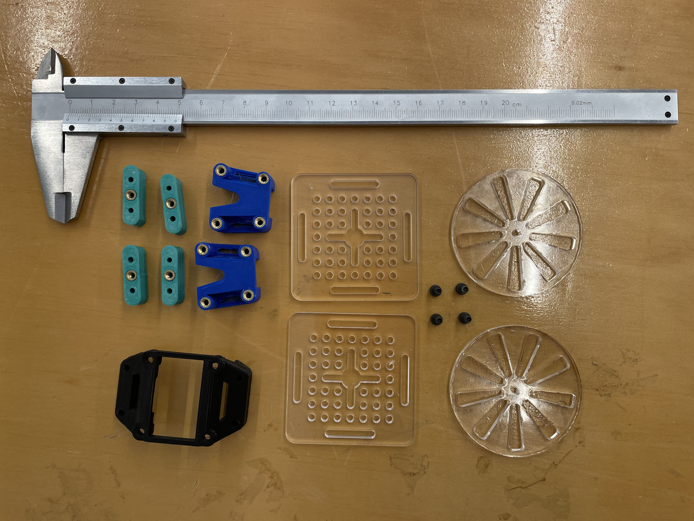

# Pancake-Robot

Pancake robot es una plataforma robótica de movimiento en base a [MicroPython Pyboard v1.1](https://micropython.org), el propósito es desarrollar un robot modular que permita la fácil integración de partes y piezas según el propósito de cada equipo de desarrollo.
