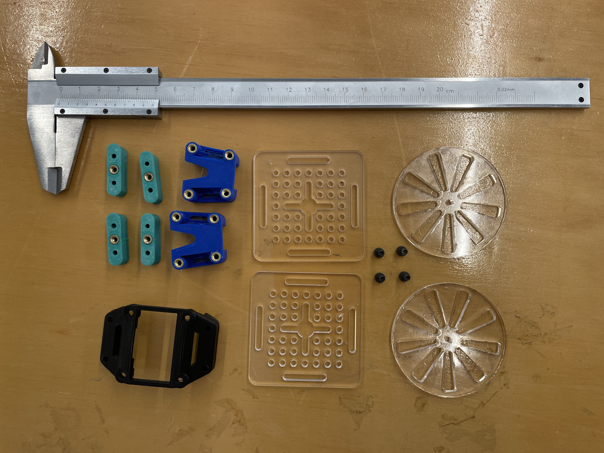

# Pancake-Robot


**Pancake Robot** es una plataforma robótica de movimiento de dos ruedas que utiliza como base una [MicroPython Pyboard v1.1](https://micropython.org), el propósito es desarrollar un robot modular, que permita la fácil integración de partes y piezas según el propósito de cada equipo de desarrollo, ademas de facilitar el proceso de aprendizaje y asimilación de conceptos de codigo.

> [!IMPORTANT]
> *El proyecto nacio como un ejercicio académico [^1] para mostrar un proceso de pototipado. El proyecto se encuentra en desarrollo, esta abierto a colaboración.*

## Stack
Herramientas y conocimientos a utilizar en el proyecto.
- [Python](https://www.python.org)
- [Micropython](https://micropython.org)
- [Fusion 360](https://www.autodesk.com/products/fusion-360/overview)

## Componentes
Utilizados en el proceso de desarrollo (hasta la fecha)
| Item | Cantidad |
| :--- | :---: |
|Pyboard v1.1 | 1 |
|Motores 1.2V | 2 |
|BRV8833 | 1 |
|MPU6050 | 1 |

## Estructura del Proyecto
Orden de las carpetas y archivos.
```Bash
$PANCAKE-ROBOT
├── code # Archivos de codigo (MicroPython)
├── fusion-360 # Archivos de modelacion 3D
├── dxf-file # Archivos de Corte Laser
└── stl-file # Archivos de Impresion 3D
└── images # Imagenes
```
## :school_satchel: Bases del Proyecto
Los siguientes contenidos, obedecen a las diferentes temáticas vistas en clases, es un proyecto paralelo que ayuda a visualizar cada paso.

### :postbox: 1. Contexto
ODS 9 - Industria, innovación e Infraestructura.
Observación de estudiantes en sala de clases de programación con Python. Los estudiantes aprenden código por medio de ver ejemplos.

### :clipboard: 2. Hipótesis
*"La integración de proyectos con componentes físicos en la enseñanza de programación incrementa significativamente la comprensión y retención de conceptos algorítmicos en estudiantes universitarios de primer año, en comparación con métodos tradicionales de instrucción."*

### :books: 3. Investigación y observaciones principales
*Fuentes*
- Benefits and introduction to python programming for freshmore students using inexpensive robots - https://ieeexplore.ieee.org/abstract/document/7062611
- A Survey of Robot Programming Systems - https://www.societyofrobots.com/robottheory/Survey_of_Robot_Programming_Systems.pdf
- The effects of educational robotics in programming education on students' programming success, computational thinking, and transfer of learning - https://onlinelibrary.wiley.com/doi/abs/10.1002/cae.22664

:pushpin: *Oportunidad*

Existe la oportunidad de utilizar dispositivos físicos, para optimizar el aprendizaje, en programación para estudiantes universitarios.

:pushpin: *Insight*

Los estudiantes universitario requieren de un sistemas físicos (robot) para optimizar el aprendizaje de programación, porque lo abstracto se vuelve mas concreto al momento de asimilar los contenidos.

### :page_facing_up: 4. Problemáticas
La programación constituye una problemática central en la pedagogía universitaria, pues presenta una dificultad intrínseca para los estudiantes al momento de asimilar conceptos lógicos.  Esto se incrementa debido a la distancia qu existe entre la teoría y la practica.

### :green_book: 5. Problema Seleccionado
La escasez de objetos que ayuden a comprender los conceptos de programación (abstractos) genera dificultades al momento de adquirir un nuevo lenguaje para estudiantes universitarios

### :dart: 6. Objetivo
Favorecer el aprendizaje de conceptos fundamentales de programación mediante el diseño y desarrollo de un dispositivo educativo que pueda ser programado por los estudiantes a través de órdenes sencillas para completar una misión, logrando un aumento de al menos un 5% en la comprensión de ideas abstractas como secuencias, bucles y condicionales, durante un periodo de ocho semanas, evaluado mediante actividades diagnósticas y de cierre.

### :pencil: 7. Desafío de diseño
**¿Como podemos facilitar el entendimiento en programación, por medio del uso de un robot, para estudiantes universitarios?**

### :triangular_ruler: 8. Solución
Robot, de dos ruedas, totalmente programable por el usuario, que se mueva por medio de ordenes sencillas ingresadas en lenjuage Python.

### :black_nib: 9. Concepto de Diseño
Plataforma robotica, que integre diferentes componentes electronicos, como placa controladora, motores y sensores. Que permitan hacer que el robot se mueva de manera autonoma y alerte la colisión con otros objetos y que permitan la recolección de datos del medio.

### :scissors: 10. Proceso de Prototipado
A continuación se presentan los diferentes prototipos desarrollados.

Revisa el siguiente documento :point_right: [Proceso de Prototipado](PROTOTIPOS.md)

## Licencia
[MIT License](LICENSE)

[^1]: Taller de Diseño en Ingenieria, [FIC Universidad Adolfo Ibañez](https://www.uai.cl/ingenieria-y-ciencias), Chile
